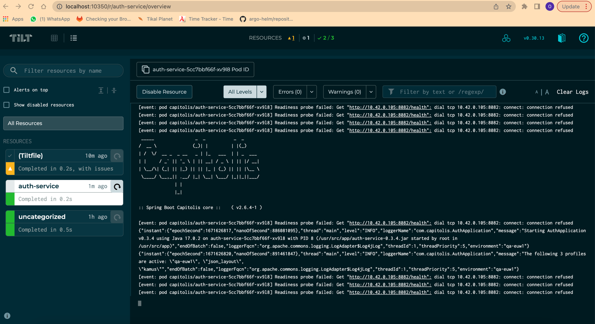

# local-env-tilt
 requierments:
> Make
> 
> k3d
> 
> aws-cli
>
## Tilt
this project was writen to create local develop environment using k3d cluster and Tilt tool:

https://docs.tilt.dev/index.html

Tilt is a developer tool that is designed to make it easier to develop, deploy, and debug applications that use Kubernetes. Tilt is designed to work with a wide range of development languages and frameworks, and it provides a number of features to make it easier to work with Kubernetes

In this repository i have implemnted a local deployment of auth-service-helm umbrella in k3d cluster:


Tiltfile is the place we define our tilt resources , in this case auth-service: 
```
auth_service = helm(
  '../capitolis-helm-charts/auth-service-helm',
  name='auth-service-helm',
  namespace='capitolis',
  values=['../capitolis-helm-charts/envs/qa-euw1/env.yaml', '../capitolis-helm-charts/envs/qa-euw1/services-values.yaml']
  )

k8s_yaml(auth_service)
```
every developer can easily define which project he wish to deploy according to previous example .

## Make
Our make file designed to allow us to run scripts with simple commands:
```
sudo make install-k3d
```
installs k3d cluster , creates capitolis ns and installs Tilt tool
```
sudo make pre-local-env
```
apply k8s manifests such as pv sa capitolis secrets configured in local-capitolis.yaml
```
sudo make update-ecr-secret <mfa_token>
```
script genarates mfa credentials with mfa token and inject it with config map into cluster, cronjob updates capitolis-ecr-access secret to ensure access to capitolis docker images.
```
sudo make run-tilt
```
get Tiltfile configurations and runs Tilt dashboard on localhost.